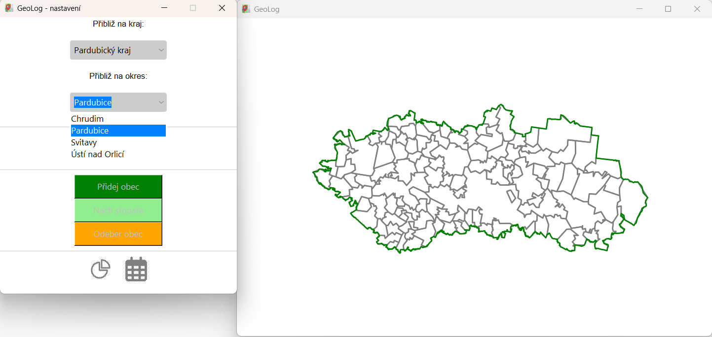
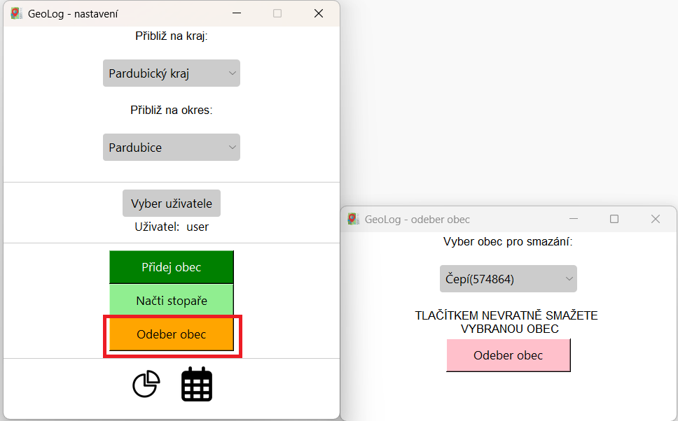

# GeoLog
  
**User interface for recording tourist-visited municipalities**  
 
- Tkinter user interface  
- Displaying territorial units in a Matplotlib graph (with zoom)  
- User account selection, creation, and deletion as tables in a local database  
- Manual addition and deletion of visited municipalities  
- Support for adding municipalities based on coordinates from the output of the Stopař (tracking module) feature from Mapy.cz (GPX file)    

## Used Data   
- Spatial data - [ArcČR 4.1](https://www.arcdata.cz/cs-cz/produkty/data/arccr)
- [icon](https://icon-icons.com/icon/nearby-map-location-address/88844)
- Tkinter theme - [Azure-ttk-theme](https://github.com/rdbende/Azure-ttk-theme/)
- [Calendar icon](https://www.iconfinder.com/icons/8664796/calendar_days_icon) , [Statistics icon](https://www.iconfinder.com/icons/2849805/pie_chart_stats_multimedia_statistics_icon) -  [license]( https://creativecommons.org/licenses/by/4.0/)
## Funcionality   
In first combobox in settings panel you can pick a region to zoom to.  
     
This action will unlock second combobox where you can pick a district to zoom to.    
    
In second part od the settings panel you can open user settings window.   
In the combobox there you can select an existing user.  
   
Clicking the green button in this panel will take you to a new panel where you can create an new user.  
  
By clicking on the orange button in the user settings panel will open a window where you can delete an existing user.  
  
By clicking on the green button in settings panel, new panel will appear, where you can add visited municipality.  
based on region and district where it lays. You can also choose a day of visiting.  
   
By clicking on the orange button in settings panel, new panel will appear, where you can remove visited municipality.  

