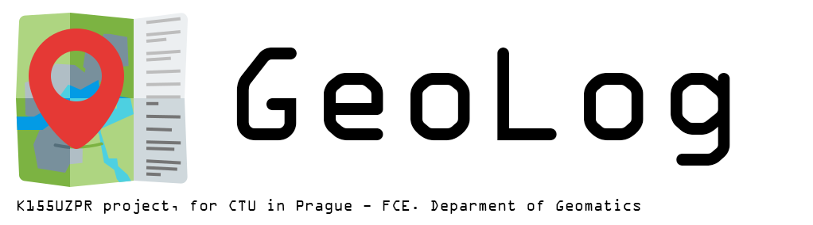
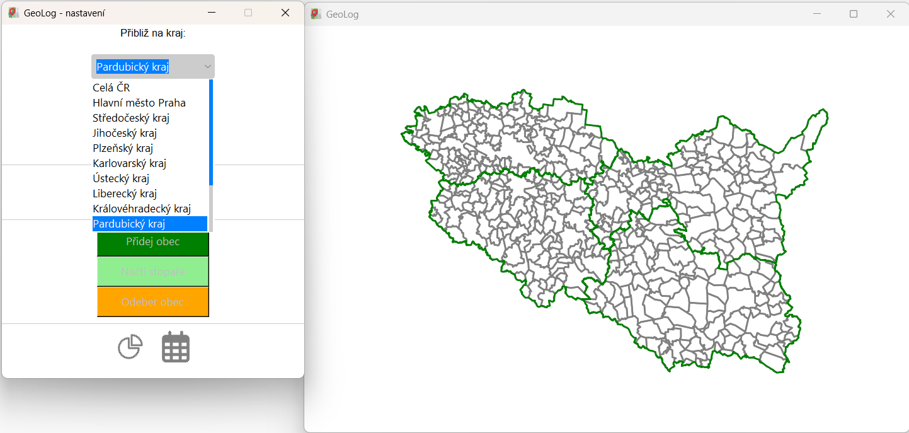
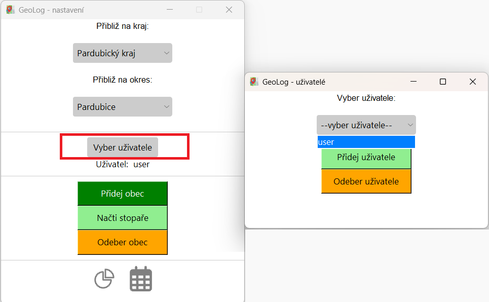
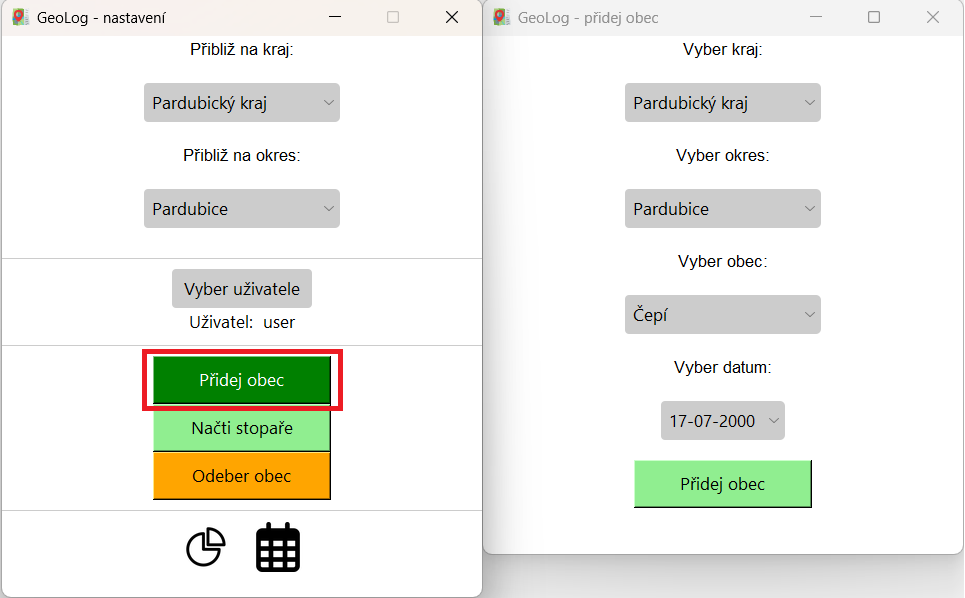

# GeoLog
  
**User interface for recording tourist-visited municipalities**  
 
- Tkinter user interface  
- Displaying territorial units in a Matplotlib graph (with zoom)  
- User account selection, creation, and deletion as tables in a local database  
- Manual addition and deletion of visited municipalities  
- Support for adding municipalities based on coordinates from the output of the Stopař (tracking module) feature from Mapy.cz (GPX file)  
- Visited municipalities filtering based on date of visiting  
- Statistics of visited municipalities in state, regions and districts  
- Support for all basic windows resolutions   

## Used Data   
- Spatial data - [ArcČR 4.1](https://www.arcdata.cz/cs-cz/produkty/data/arccr)
- [icon](https://icon-icons.com/icon/nearby-map-location-address/88844)
- Tkinter theme - [Azure-ttk-theme](https://github.com/rdbende/Azure-ttk-theme/)
- [Calendar icon](https://www.iconfinder.com/icons/8664796/calendar_days_icon) , [Statistics icon](https://www.iconfinder.com/icons/2849805/pie_chart_stats_multimedia_statistics_icon) -  [license]( https://creativecommons.org/licenses/by/4.0/)
## Funcionality   
In first combobox in settings panel you can pick a region to zoom to.  
     
This action will unlock second combobox where you can pick a district to zoom to.    
    
In second part od the settings panel you can open user settings window.   
In the combobox there you can select an existing user.  
   
Clicking the green button in this panel will take you to a new panel where you can create an new user.  
  
By clicking on the orange button in the user settings panel will open a window where you can delete an existing user.  
  
By clicking on the green button in settings panel, new panel will appear, where you can add visited municipality.  
based on region and district where it lays. You can also choose a day of visiting.  
   
By clicking on the orange button in settings panel, new panel will appear, where you can remove visited municipality.  
   
By clicking on the light green button in settings panel, new panel will appear, where you can load GPX file from Stopař module made by Mapy.cz or any other  
   
In this window you can find your GPX file by pressing the grey "Načti soubor" button.  
   
Upon selecting your file, you can confirm your selection by clicking the light green button below and add municipalities that you have visited.  
   
You can enter date selection window by pressing the calendar icon. 
   
Insert range of dates from you want to filter your visited municipalities and confirm your selection by button below. 
You will be able to see your visited municipalities with dates in text window below. 
   
Upon clicking the piechart button, window with statistics will appear. 
   
In this statistics window you can se percentages of visited municipalities in the Republic and in its regions. 
Use the scrollbar on the right to see all regions or click the button to see district statistic.  
   
Now you can see the three most visited districts. Select a district to show its statistics in a new window. 
 
  
Upon each addition or removal of a municipality or when a user is changed, the map window updates, and the visited municipalities in the currently selected zoom level are colored in red. 

